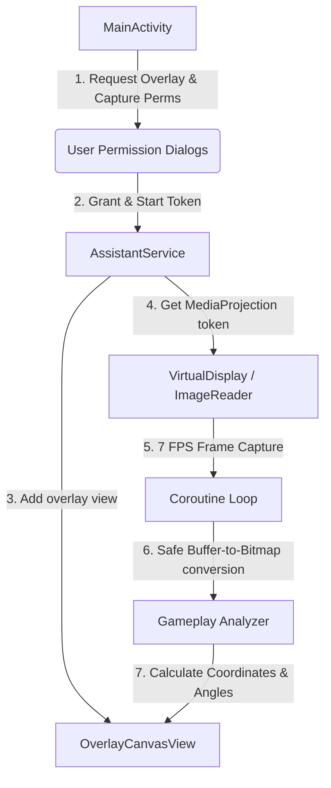

# Efootballhelp

A production-ready, GPLv3-compliant Android application designed to run a low-latency, battery-safe gameplay helper for eFootball Mobile. The app captures the game interface via a foreground screen-capture stream, processes frames in a background thread pool, and draws floating tactical overlays (dashed passing vectors, player targeting circles, defender threat zones) directly on top of the running game interface.

---

## Architecture Overview

### 1. Foreground Service & Overlay Window (`AssistantService.kt`)
* **Service Lifecycle:** Initiates a persistent system notification as a foreground service using `ServiceInfo.FOREGROUND_SERVICE_TYPE_MEDIA_PROJECTION` to guarantee survival under Android's aggressive background limitations.
* **Layout Inflation:** Uses Android's `WindowManager` to programmatically attach a full-screen instance of `OverlayCanvasView` directly to the window stack.
* **Input Passthrough:** Configured using `TYPE_APPLICATION_OVERLAY` and specific flags (`FLAG_NOT_FOCUSABLE`, `FLAG_NOT_TOUCHABLE`, `FLAG_LAYOUT_IN_SCREEN`, `FLAG_LAYOUT_NO_LIMITS`). This guarantees that touches pass through to the game with zero latency and that the canvas aligns with physical screen dimensions.

### 2. Screen Capture Engine (`MediaProjection` & `ImageReader`)
* **Virtual Display Setup:** Requests screen frames via Android's `MediaProjectionManager`.
* **Battery-Safe Ingestion:** Throttled to ~7 FPS (150ms intervals) using Kotlin Coroutines (`Dispatchers.Default` and custom delay control) to prevent CPU throttling, heat generation, or rapid battery drain.
* **Memory Safety & Leak Avoidance:**
  * Raw frames are acquired using `imageReader.acquireLatestImage()`.
  * Multi-plane alignment padding is extracted and removed dynamically to crop images back to clean pixel resolution.
  * Bitmaps are recycled (`bitmap.recycle()`) and image buffers are closed (`image.close()`) in a strict `finally` block to return native memory allocations to the system buffer queue.

### 3. Dynamic Tactical Canvas (`OverlayCanvasView.kt`)
* **Custom view drawing:** Extends `View` and overrides `onDraw(canvas: Canvas)`.
* **Tactical Indicators:**
  * Draws a yellow target circle around the ball-carrier player.
  * Draws a red circle around nearby opponent threat zones (defenders).
  * Draws a green dashed vector arrow indicating the passing trajectory.
  * Displays numerical telemetries (calculated angles and estimated passing velocities) using standard `Paint` configurations.
* **Thread Safety:** Updates coordinates inside a thread-safe `postInvalidate()` redraw loop triggered directly from the image processing thread.

---

## Project Requirements & Targets

* **Minimum SDK:** 26 (Android 8.0 Oreo)
* **Target/Compile SDK:** 34 (Android 14)
* **Language:** Kotlin 1.9.22
* **Build System:** Gradle (Kotlin DSL, `build.gradle.kts`)
* **License:** GNU General Public License v3 (GPLv3)

---

## File Directory Map

The code files are located as follows:
* [LICENSE](file:///home/younes/EfootballHelp/LICENSE) - Full GNU General Public License v3 text.
* [MainActivity.kt](file:///home/younes/EfootballHelp/app/src/main/java/com/efootballhelp/MainActivity.kt) - Entry point launcher, UI dashboard, and permissions request pipeline.
* [AssistantService.kt](file:///home/younes/EfootballHelp/app/src/main/java/com/efootballhelp/AssistantService.kt) - Foreground service class, screen capture loops, and window overlay layout parameters.
* [OverlayCanvasView.kt](file:///home/younes/EfootballHelp/app/src/main/java/com/efootballhelp/OverlayCanvasView.kt) - Custom view responsible for raw pixel operations and vector rendering.
* [AndroidManifest.xml](file:///home/younes/EfootballHelp/app/src/main/AndroidManifest.xml) - Declares service types, permissions, and app entry points.

---

## License & Compliance

Every Kotlin and XML source file in this project contains the standard GNU GPLv3 licensing header. The full copyleft terms are available in the root [LICENSE](file:///home/younes/EfootballHelp/LICENSE) file. 

This program is free software: you can redistribute it and/or modify it under the terms of the GNU General Public License as published by the Free Software Foundation, either version 3 of the License, or (at your option) any later version.
